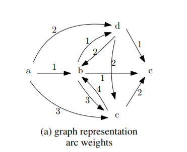

# SOP optimization

Solving SOP with SA, GRASP, Tabu Search algorithms.

## Problem Description
The Sequential Ordering Problem **(SOP)** with precedence constraints consists of finding a minimum weight Hamiltonian path on a directed graph with weights on the arcs and on the   nodes, subject to precedence constraints among nodes.

<div align="center">
  
  
</div>


## Instance Description
**TSPLIB** is a library of sample instanes for the TSP (and related problems) from various soures and of various types.
Instanes of the following problem classes are available:
+ Symmetric traveling salesman problem **(TSP)**
+ Hamiltonian cycle problem **(HCP)**
+ Asymmetric traveling salesman problem **(ATSP)**
+ Sequential ordering problem **(SOP)**
+ Capaitated vehicle routing problem **(CVRP)**
- ### The file format
  Each file consists of **specification part** and of a **data part**. The specification part contains information on the file format and on its contents. The data part contains explicit data. 
python implementation

## Algorithms

All the algorithms are designed base on the **Lexicographic Search** using **forwarding and back warding path-preserving-3-exchange** as explained in [An Ant Colony System Hybridized with a New Local Search for the Sequential Ordering Problem paper](http://people.idsia.ch/~luca/fd18cc00a0_article.pdf).

<div align="center">
  
  
</div>


```
$ cd Assignment-01/external/glfw-3.0.3
$ cmake .
```


## References
OpenGL Tutorials. *Tutorial 1: Opening a Window*, Available at [Link to the paper](http://www.opengl-tutorial.org/beginners-tutorials/tutorial-1-opening-a-window/) (Accessed: 3rd April 2016).

SOP images srouce => The paper : [Tree search algorithms for the Sequential Ordering Problem](https://arxiv.org/pdf/1911.12427.pdf)
